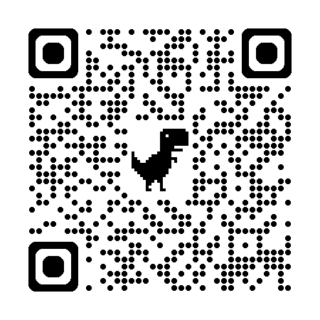
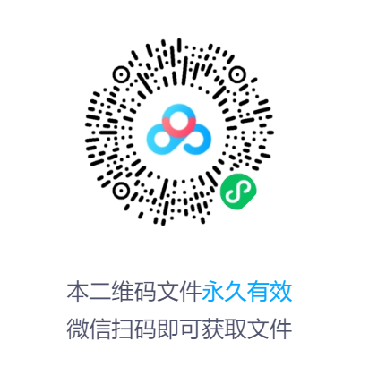

# 程序源码
> - 分享目的仅供学习和交流，请不要用于其他非法用途!
> - 如有具体需求,进行项目定制，欢迎联系 [点击项目定制 | Java糕手](http://127.0.0.1:5173/javamaster/main/design.html))

## 说明
1. **代码绝非市面上的低质量代码，可放心运行和使用；一经售出，概不退还**
2. **购买调试运行服务后，包调试运行成功，并可免费提供 简单问题及运行相关问题 在线管疑**

## 价格&介绍视频

#### 价格

- 程序源码（前后端源码及数据库sql文件）+ 配套文档   现价99/套
- 程序源码（前后端源码及数据库sql文件）+ 远程配置调试运行  现价129/套

#### 项目介绍视频

1、所有项目介绍视频可浏览以下链接（哔哩哔哩视频），可根据名称检索

https://space.bilibili.com/484414824

2、或浏览下方的百度网盘链接

Java项目视频--链接: https://pan.baidu.com/s/14r0u9pE7veQARRqJ7CXhkw?pwd=1ju2 提取码: 1ju2 

## 服务内容
- 程序源码&数据库文件
- 对应文档

## 开发工具及技术

**开发工具**

- IntelliJ IDEA
- Visual Studio Code
- HBuilder
- 微信开发者工具

**编程语言：**
- Html、Css、JavaScript
- Java

**框架/技术：**
- Spring、SpringMvc、SpringBoot
- MyBatis/MyBatisPlus
- MySQL
- Vue

## 其他服务

如需代码讲解答疑、系统设计文档等相关服务也可联系我

---

